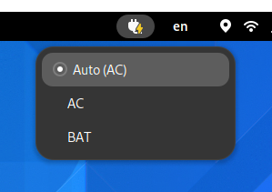

<h1> GNOME-TLP</h1>

This is an [AppIndicator](https://github.com/ubuntu/gnome-shell-extension-appindicator) that displays and also allows
switching the current [TLP](https://linrunner.de/tlp/) mode between auto, AC, and battery.
Unlike [TLP-Switcher](https://github.com/rosghub/TLP-Switcher) it will never modify (or overwrite) your TLP configuration
and is also an AppIndicator instead of a GNOME Shell Extension, which means it is independent of Shell version updates.
The icons are derived from the [GNOME symbolic icons](https://teams.pages.gitlab.gnome.org/Design/icon-development-kit-www/).

## Indicator Icon

In automatic mode, the AC plugged status will match the power profile:

AC plugged | On Battery
:---------:|:----------:
 | 

A small dot in the upper right corner will indicate that the automatic power profile selection has been overriden.

 _ | AC plugged | On Battery
--:|:----------:|:----------:
**Performance**    |  | 
**Battery saving** |  | 

## Installation

As `sudo` is required to [change the TLP mode](https://linrunner.de/tlp/usage/tlp.html), you should put something like
the following in your [`sudoers` file](https://www.digitalocean.com/community/tutorials/how-to-edit-the-sudoers-file).
Replace `<MY_USER>` with your username and check that the paths for `tlp` and `tlp-stat` are correct, e.g. using `which`. 

```
# /etc/sudoers.d/tlp
<MY_USER> ALL = NOPASSWD: /usr/sbin/tlp
<MY_USER> ALL = NOPASSWD: /usr/bin/tlp-stat
```

You can then install the code from this repo simply using pip
```bash
pip install git+github.com/N-Coder/gnome-tlp
```

After installation is done, ensure that your GNOME shell [automatically starts](https://help.gnome.org/admin/system-admin-guide/stable/autostart-applications.html) the widget upon boot.
You can again use `which` to find the path of the `gnome-tlp` command.
```
# ~/.config/autostart/gnome-tlp.desktop 
[Desktop Entry]
Type=Application
Exec=<PATH/TO/gnome-tlp>
Hidden=false
X-GNOME-Autostart-enabled=true
Name=GNOME-TLP
```
